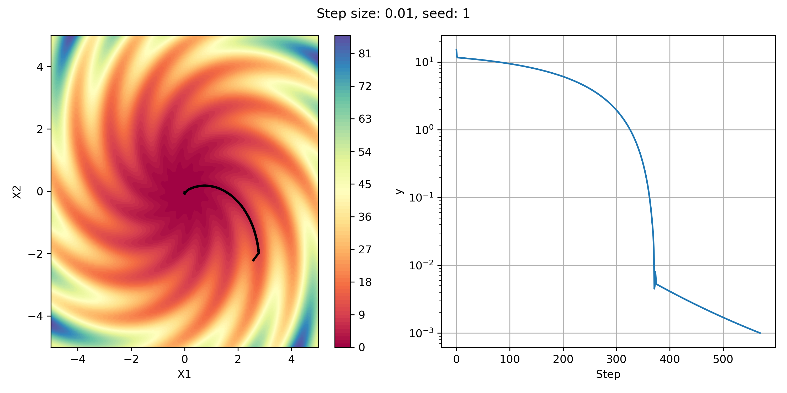
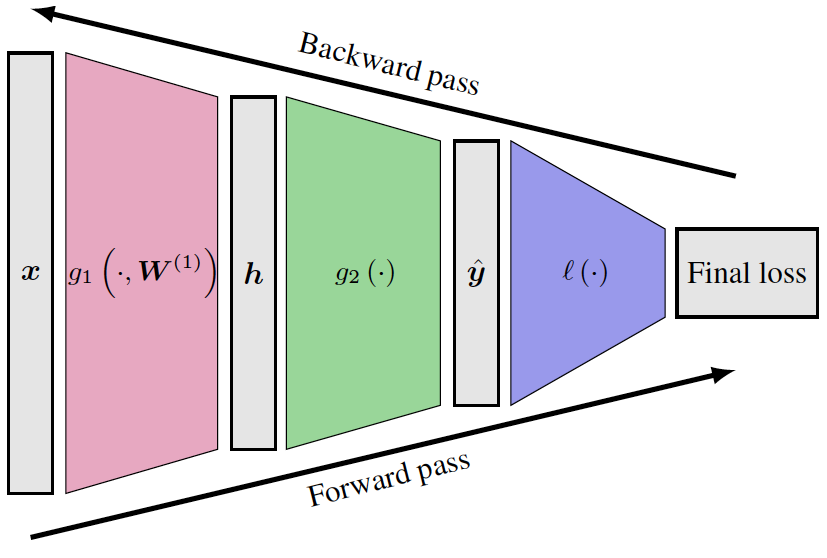

# DeepLearning-Project-1-Backpropagation
In the first part of this project, a basic gradient optimization in the 2D space is implemented via hand-calculated derivatives, and then, in the second part, we explore what happens under the hood of learning in the backpropagation method by developing the forward and backward pass classes for a simple three-layer MLP.

This project was developed as part of CSE 849 (Deep Learning - Spring 25 Semester) at the Computer Science Department of Michigan State University, taught by Dr. Zijun Cui (@zijunjkl), with TA support from Gautam Sreekumar (@gautamsreekumar). Special thanks to them for their guidance and materials.
